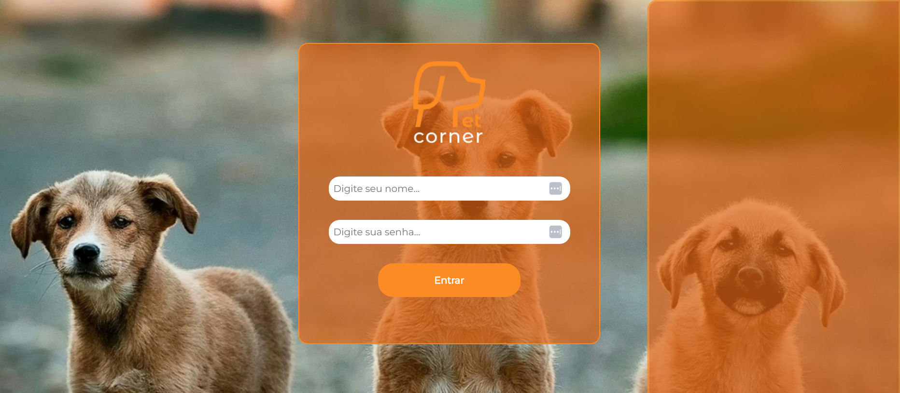
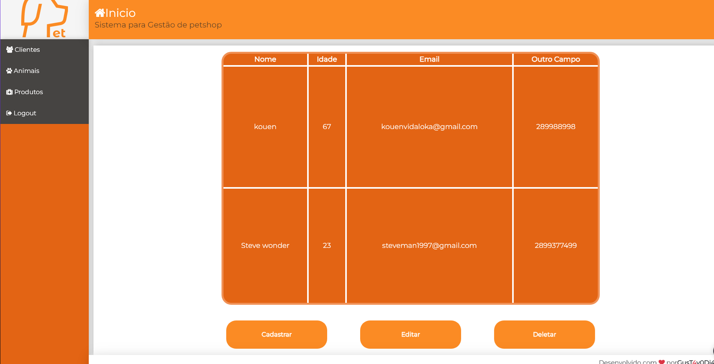

# PetCorner - Sistema de Gerenciamento

Este é o projeto **PetCorner**, um sistema web de gerenciamento voltado para o cadastro de clientes, animais, produtos e serviços de uma pet shop. O sistema é desenvolvido em **React**, com a integração de um servidor de dados local utilizando o **JSON Server**.

## Estrutura do Projeto

### Principais Diretórios:
- **src/components**: Contém os componentes principais da aplicação, divididos por funcionalidade.
  - **Clientes**: Formulários e visualização de clientes cadastrados.
  - **Login**: Tela de login do sistema.
  - **Template**: Componentes de layout, como Header, Footer e Nav.
- **src/contexts**: Contexto de autenticação e gerenciamento de estado.
- **src/main**: Arquivos principais como `App.js`, que controla as rotas e estrutura da aplicação.
- **src/services**: Serviços para comunicação com a API, como `api.js` para interagir com o backend.

### Principais Tecnologias Utilizadas:
- **React**: Framework JavaScript para criação de interfaces de usuário.
- **JSON Server**: Utilizado para simular um backend, servindo dados de um arquivo `db.json`.
- **Axios**: Para fazer requisições HTTP à API.
- **Lottie**: Animações SVG, ativadas em interações do usuário.
- **React Router Dom**: Para gerenciamento de rotas da aplicação.
- **MUI (Material-UI)**: Biblioteca de componentes para estilização.

## Funcionalidades

- **Cadastro de Clientes**: Permite o registro de clientes, exibindo informações como nome, idade e e-mail.
- **Autenticação**: Sistema básico de login.
- **Navegação**: Menu de navegação com opções de clientes, produtos e logout.
- **Animação Lottie**: Uma animação interativa que é ativada ao passar o mouse sobre o botão de login.

## Pré-requisitos

Antes de rodar o projeto, certifique-se de ter o **Node.js** e o **npm** (Node Package Manager) instalados.

## Instalação

1. Clone o repositório:
   ```bash
   git clone https://github.com/seu-usuario/PetCorner-React.git
   ```

2. Navegue até o diretório do projeto:
   ```bash
   cd PetCorner-React
   ```

3. Instale as dependências do projeto:
   ```bash
   npm install
   ```

## Rodando a Aplicação

Para rodar o projeto localmente, você pode usar o seguinte comando:

```bash
npm run dev
```

Isso executará tanto o servidor React quanto o servidor de API mock (JSON Server).

- **Aplicação React**: Disponível em [http://localhost:3000](http://localhost:3000)
- **JSON Server**: Disponível em [http://localhost:3001](http://localhost:3001)

Para fazer o login utilize as credenciais:
admin@gmail.com
12345

## Estrutura de Arquivos

```bash
frontend/
├── src/
│   ├── components/
│   │   ├── Clientes/
│   │   │   ├── Form/
│   │   │   │   ├── form.css
│   │   │   │   └── Form.jsx
│   │   │   ├── home/
│   │   │   │   ├── home.css
│   │   │   │   └── Home.jsx
│   │   │   ├── Login/
│   │   │   │   ├── login.css
│   │   │   │   └── Login.jsx
│   │   ├── template/
│   │       ├── Footer.jsx
│   │       └── Header.jsx
│   ├── contexts/
│   │   └── AuthContext.js
│   ├── services/
│   │   └── api.js
│   ├── main/
│       ├── App.jsx
│       └── Routes.jsx
├── db.json
└── package.json
```

## Imagens

### Tela de Login


### Tela de Cadastro de Cliente


## Contribuição

Se desejar contribuir com este projeto, faça um fork e crie uma branch com sua feature:

```bash
git checkout -b minha-feature
```

Depois faça o commit e um pull request para análise:

```bash
git push origin minha-feature
```

---

